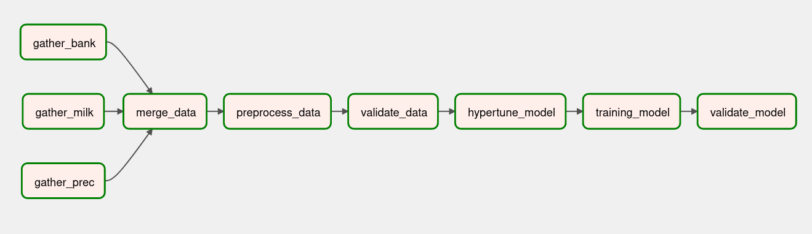
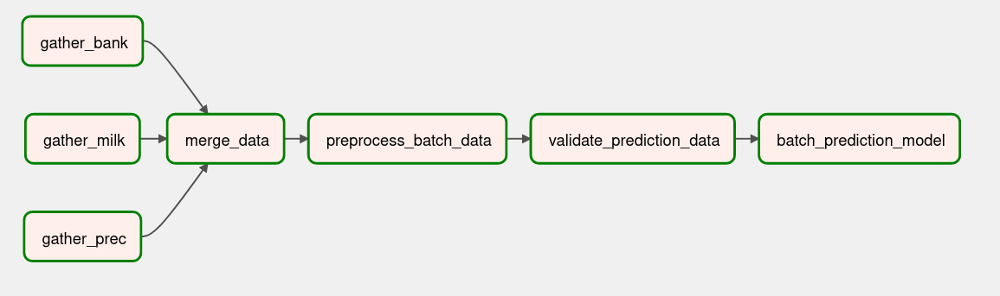

# MLOPS end2end toy project

Stack: airflow + fastAPI + Nginx + PostgreSQL + Alembic

# Overview
Este proyecto contiene los archivos necesarios para entrenar y poner en produccion un modelo que predice el precio de la leche basandose en variables de precipitacion, financieras y precios pasados de la leche. 

La solucion construida contempla la obtencion de predicciones con data en tiempo real, pero tambien usando predicciones previamente construidas (batch). A pesar que construi estos dos enfoques, considero que para este caso de uso solo se debio haber considerado una solucion de prediccion por batch y no en tiempo real. Llegue a esta conclusion ya que la data de entrenamiento es una muestra por mes, es decir durante el mes solo se obtiene un precio. Por tanto, en tiempo de prediccion el modelo esperaria que la data tuviese el mismo comportamiento. Considerando estas cosas, se puede concluir que la informacion enviada en distintos dias del mes no cambiara. Finalmente, tener un modelo que corre el predict del modelo usando la misma data daria costos extras que se podrian evitar.

En las siguientes secciones de la documencion se detallara los componentes definidos en el proyecto.

## Contenido
1) Estructura del proyecto
2) Entrenamiento del modelo
3) Prediccion offline por batch
4) Servicio de prediccion
5) Ejecucion
6) Comentarios y mejoras

## Estructura del proyecto

```
├── airflow
│   ├── dags
│   │   ├── __init__.py
│   │   ├── pipelines
│   │   │   ├── food_model
│   │   │   │   ├── constants.py                # Se configuran las variables a preprocesar
│   │   │   │   ├── data.py                     # Funciones relacionadas al preprocesamiento
│   │   │   │   ├── __init__.py
│   │   │   │   ├── model_pipeline.py           # DAG de entrenamiento del modelo
│   │   │   │   ├── model.py                    # Funciones para el entrenamiento del modelo
│   │   │   │   └── prediction_pipeline.py      # DAG de prediccion por batch
│   │   │   └── __init__.py
│   │   └── utils
│   │       ├── config.py                       # Configuracion de los DAG's
│   │       ├── __init__.py
│   │       └── transformers.py                 # Contiene clases de preprocesamiento
│   ├── Dockerfile
│   ├── requirements.txt
│   └── setup.py
├── app
│   ├── app
│   ├── alembic                                 # Alembic folder
│   ├── alembic.ini
│   │   ├── __init__.py
│   │   ├── score_router.py                     # Router 
│   │   └── utils.py
│   ├── __init__.py
│   ├── log.config                              # Configuracion de los logs
│   └── main.py                                 
├── artifacts                                   # Se guardan los pipelines serializados
├── data                                        # Se guarda la data
│   ├── batch_predictions/                      # Se guardan las predicciones del batch
│   ├── feature_store/                          
│   ├── interm/                                 # data resultante de pasos intermendios
│   ├── preprocessed/                           # Se guarda la data luego de ser procesada
│   └── raw/                                    # Se guarda la data en crudo
├── docker-compose.yml
├── Dockerfile
├── docs
├── nginx_config.conf
├── README.md
└── requirements.txt
```

## Entrenamiento del modelo
En esta fase se realiza el entrenamiento del modelo y preprocesamiento de la data, asi como tambien, la serializacion de los pipelines generados en estas etapas. Por cada paso, se guarda la data a modo de versionamiento. Tanto los pipelines como la data de output de cada etapa, se guarda de manera local en .pkl o .csv. Idealmente, seria mejor manejar un bucket de AWS o GCP para el guardado de los artefactos (pipeline de entrenamiento y preprocesamiento) y una BD o un bucket con versionamiento para los datos procesados. En la *Fig.1*, se detallan los pasos que componen el dag del entrenamiento del modelo en Airflow.
*Periodicidad de la ejecucion (CRON): Cuando se considere un reentrenamiento del modelo.* 

<figure>
  
  <figcaption style="text-align: center;">Fig.1 - Dag de entrenamiento del modelo.</figcaption>
</figure> 

A continuacion explicare brevemente el objetivo de cada uno de estos pasos:
  - **Data gathering**: Es el conjunto de pasos donde se recolecta la data y se realizan pequeñas modificaciones, con el fin de preparar la data para el merging. Este dag guarda la data modificada en nuevos archivos .csv en la ruta `/data/interm/collect_*`.
  - **Merge data**: Se realiza el merging de las fuentes con las que se trabajaran, tambien se realiza un ordenamiento de la informacion en funcion a la fecha y se guarda en la ruta `/data/interm/merge_data.csv`
  - **Preprocess data**: Se realiza el preprocesamiento de los datos usando pipelines de sklearn y posteriormente se serializa el pipeline, ademas tambien se guardan los features generados en un .csv, idealmente deberia existir un feature store usando alguna herramienta como Feast. El pipeline se guarda en la carpeta `/artifacts/data_pipeline.pkl`, mientras que el archivo con los features se guarda en `/data/feature_store/efficient_feature_store.csv`
  - **Validate data**: Incorpora algunas validaciones; por cuestion de tiempo, las validaciones incoporadas son muy basicas, pero idealmente en este paso tambien deberia guardarse estadisticas de la data como la media de la distribucion. Estos estadisticos serviran posteriormente para ver si la informacion ha cambiado en cuanto a su distribucion y con ello tomar la decision de reentrenar el modelo.
  - **Hypertune parameters**: Se toma como input la data preprocesada y realiza la busqueda de hiperparametros y se guardan en `/artifacts/best_params.json`.
  - **Training model**: Se lleva a cabo el entrenamiento del modelo tomando como input la data preprocesada y los mejores hiperparametros encontrados. El modelo entrenado se serializa en `/artifacts/model_staging.pkl`, mientras que las metricas se encuentran an `/artifacts/model_metrics.json`
  - **Validate model**: En este paso se verifica si el modelo previamente entrenado es lo suficientemente bueno para ser promovido a prod. Se incorporaron validaciones muy simples, pero idealmente se deberian incorporar mas validaciones como por ejemplo, ver si el nuevo modelo es mejor o parecido al anterior usando las metricas de validacion. El modelo se serializa en `/artifacts/model_prod.pkl`.

## Prediccion offline por batch
En esta seccion se detalla el dag que opera la prediccion por batches. En la *Fig.2*, se detallan los pasos que componen al dag.
*Periodicidad de la ejecucion (CRON): De manera mensual, ya que la data es ingestada de esa forma.* 
<figure>
  
  <figcaption style="text-align: center;">Fig.2 - Dag de entrenamiento del modelo.</figcaption>
</figure> 

A continuacion se detalla el objetivo de los pasos mostrados en la *Fig.2*:
  - **Gathering data y Merge data**: Estos pasos son identicos a los mencionados en la seccion 2. Como mejora de estos procesos, la informacion se deberia guardar de forma separada (actualmente se sobreescriben los mismos archivos), ya que son procesos independientes.
  - **Preprocess batch data**: En esta etapa, la data mergeada se transforma en datos preprocesados usando el pipeline de datos serializado en el dag de entrenamiento. El output sera solo un csv con los nuevos features creados y se guardara en `/data/features_store/super_efficient_feature_store.csv`
  - **Validate prediction data**: El objetivo de este paso es ver si la informacion tiene una distribucion parecida a la data de entrenamiento. Actualmente por falta de tiempo se incluyeron pruebas muy simples. 
  - **Validate prediction data**: Finalmente, usando la data guardada y el modelo serializado se generan las predicciones para el batch de datos y se guarda en `/data/batch_predictions/predictions.csv`

## Servicio de prediccion
El servicio se construyo usando fastAPI y se disponibiliza a traves de Nginx. La configuracion usada es una muy simple.

Por otro lado, se uso una configuracion para guardar los logs dentro del servidor. Esta configuracion esta en `/app/log.config`

Tambien se incorporo una BD en PostgreSQL con el fin de guardar tanto la data enviada como la prediccion. Debido a que son 3 registros por peticion, se creo un *DummyUniqueID* que identificase la data de una sola peticion. Se puede ingresar a ver esta informacion en la ruta `localhost:9988` con las credenciales *admin@admin.com* para user y *root* para el pass. Se debe configurar el acceso al servidor desde PGAdmin usando los siguientes parametros.

```
HOST_NAME=db
POSTGRES_USER=db_username
POSTGRES_PASSWORD=db_password
POSTGRES_DB=db_dev
```

Respecto a las rutas del servicio, se disponibilizaron las siguientes:

### Health check
Consultar a esta ruta para verificar que el api este activo

**URL** : `localhost:8090/check_service`

**Method** : `GET`

#### Ejemplo

```
curl --location --request GET 'localhost:8090/check_service'
```

#### Respuesta

**Code** : `200 OK`

```json
{
    "Message":"Hello world from service"
}
```

### Predicion offline (batch)
Consultar algun periodo existente dentro de la base de datos de prediccion

**URL** : `localhost:8090/api/v1/get_prediction`

**Method** : `GET`

#### Ejemplo

```
curl --location --request GET 'localhost:8090/api/v1/get_prediction?year=2014&month=10'
```

#### Respuesta

**Code** : `200 OK`

```json
{
    "prediction": 219.7651880819884
}
```

### Predicion en tiempo real (batch)
Consultar algun periodo existente dentro de la base de datos de prediccion

**URL** : `localhost:8090/api/v1/get_online_prediction`

**Method** : `POST`

#### Ejemplo

```
curl --location --request POST 'localhost:8000/api/v1/get_online_prediction' \
--header 'Content-Type: application/json' \
--data-raw ' {"data": {
        "anio": [2014.0, 2014.0, 2014.0],
        "mes": [1.0, 2.0, 3.0],
        "Precio_leche": [213.02, 219.03, 227.45],
        "Coquimbo": [3.52467320647237, 1.68885621159928, 2.23720261467365],
        "Valparaiso": [2.3787662295697203, 8.38985389594424, 5.08209415435392],
        "Metropolitana_de_Santiago": [7.27827181044541,
        17.803070451948603,
        5.403087250900849],
        "Libertador_Gral__Bernardo_O_Higgins": [4.80475968850213,
        7.295178298057281,
        15.0252093448195],
        "Maule": [7.83152246846819, 3.01593177929248, 31.2800166809222],
        "Biobio": [33.6840026451552, 22.1861968265569, 78.8543882826541],
        "La_Araucania": [96.70796641882193, 43.1574105715261, 128.113099669829],
        "Los_Rios": [130.212945686754, 65.22801037229, 172.223449588746],
        "PIB_Agropecuario_silvicola": ["55.059.326", "589.162.366", "53.363.658"],
        "PIB_Pesca": ["449.097.098", "530.628.153", "107.007.804"],
        "PIB_Mineria": ["123.408.811", "118.979.099", "127.819.883"],
        "PIB_Mineria_del_cobre": ["110.892.244", "107.686.125", "115.400.625"],
        "PIB_Otras_actividades_mineras": ["125.165.676",
        "112.929.737",
        "124.192.583"],
        "PIB_Industria_Manufacturera": ["125.915.256", "117.324.454", "134.314.265"],
        "PIB_Alimentos": ["323.829.181", "326.848.287", "397.250.136"],
        "PIB_Bebidas_y_tabaco": ["160.131.672", "151.002.582", "156.581.527"],
        "PIB_Textil": ["271.608.802", "24.777.101", "291.436.774"],
        "PIB_Maderas_y_muebles": ["613.149.007", "58.489.291", "663.043.838"],
        "PIB_Celulosa": ["111.186.684", "985.263.519", "102.251.828"],
        "PIB_Refinacion_de_petroleo": ["107.176.547", "987.746.023", "115.536.937"],
        "PIB_Quimica": ["197.004.194", "169.050.011", "197.408.229"],
        "PIB_Minerales_no_metalicos_y_metalica_basica": ["6.795.359",
        "637.721.806",
        "757.357.597"],
        "PIB_Productos_metalicos": ["203.394.915", "182.004.135", "202.930.175"],
        "PIB_Electricidad": ["309.290.133", "276.725.914", "290.911.613"],
        "PIB_Construccion": ["635.812.268", "621.419.201", "710.059.845"],
        "PIB_Comercio": ["10.768.256", "106.567.859", "122.425.043"],
        "PIB_Restaurantes_y_hoteles": ["220.170.996", "21.519.997", "211.265.323"],
        "PIB_Transporte": ["539.108.727", "530.525.285", "561.815.961"],
        "PIB_Comunicaciones": ["364.948.817", "329.424.874", "344.621.056"],
        "PIB_Servicios_financieros": ["603.426.797", "602.969.763", "595.793.932"],
        "PIB_Servicios_empresariales": ["126.672.311", "116.462.931", "117.932.685"],
        "PIB_Servicios_de_vivienda": ["85.785.202", "829.465.384", "825.405.999"],
        "PIB_Servicios_personales": ["787.099.521", "690.060.504", "142.600.046"],
        "PIB_Administracion_publica": ["522.480.077", "523.184.092", "525.208.459"],
        "PIB_a_costo_de_factores": ["102.724.817", "985.454.361", "111.566.458"],
        "PIB": ["112.152.352", "107.497.828", "121.659.577"],
        "Imacec_empalmado": ["976.113.405", "935.602.943", "105.885.915"],
        "Imacec_produccion_de_bienes": ["101.540.937", "982.574.646", "107.308.181"],
        "Imacec_minero": ["977.900.376", "942.799.014", "101.285.403"],
        "Imacec_industria": ["985.915.778", "918.649.843", "105.167.997"],
        "Imacec_resto_de_bienes": ["107.470.632", "107.454.234", "114.516.992"],
        "Imacec_comercio": ["103.244.622", "102.175.861", "11.737.952"],
        "Imacec_servicios": ["93.851.301", "888.267.283", "103.080.921"],
        "Imacec_a_costo_de_factores": ["97.687.997", "9.371.354", "106.096.113"],
        "Imacec_no_minero": ["975.892.915", "934.715.034", "106.453.564"],
        "Indice_de_ventas_comercio_real_no_durables_IVCM": ["943.909.236",
        "928.126.259",
        "101.583.412"]
    }
}'
```

#### Respuesta

**Code** : `200 OK`

```json
{
    "prediction": 230.67016693669638
}
```

## Ejecucion
- Primero, se debe construir y levantar los contenedores
```
docker-compose build
docker-compose up
```
- En la carpeta se cuenta con archivos que corresponden tanto al modelo serializado como al pipeline de datos serializado; sin embargo si se desea volver a entrenar el modelo, se debe entrar a la ruta `localhost:8080` y colocar como **user** y **password** *airflow*. Una vez dentro de airflow, se debe buscar el dag `training_food_model_v1_0_0` y luego de ingresar, darle click a la opcion Trigger
- Si se deseea ejecutar la prediccion por batch, se debe ingresar a la ruta `localhost:8080` y buscar el dag `prediction_food_model_v1_0_0`
- Para consultar al API, mandar un request a alguna de las rutas especificadas en la seccion 4.

## Comentarios y mejoras
- Usar una BD para guardar la data y alguna herramienta que permita su versionamiento
- Usar un feature store para guadar los features generados por operaciones de alto costo y que pueda reusarse ya se en otros proyectos o en tiempo de prediccion, por ejemplo, Feast
- Usar alguna herramiento de monitoreo como Prometheus
- Usar AWS, GCP o alguna herramienta en la nube que permita el versionamiento de los artefactos
- Mejorar las pruebas tantos de datos como las del modelo.
- Incorporar pruebas unitarias del API
- Usar alguna herramienta como github actions para automatizar el codigo de las pruebas o de deploy
- Finalmente, se opto por hacerle deploy al modelo que considera todas las variables ya que es el que tiene mejores resultados en validacion